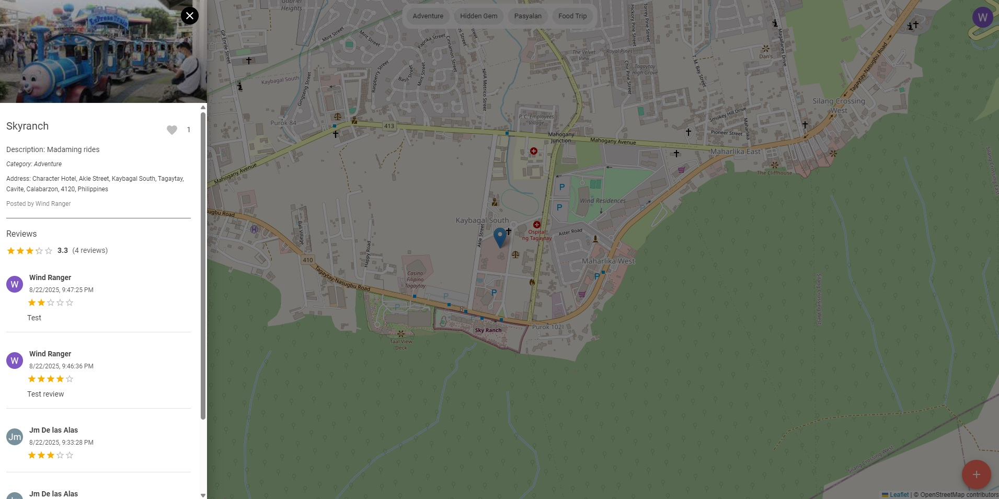
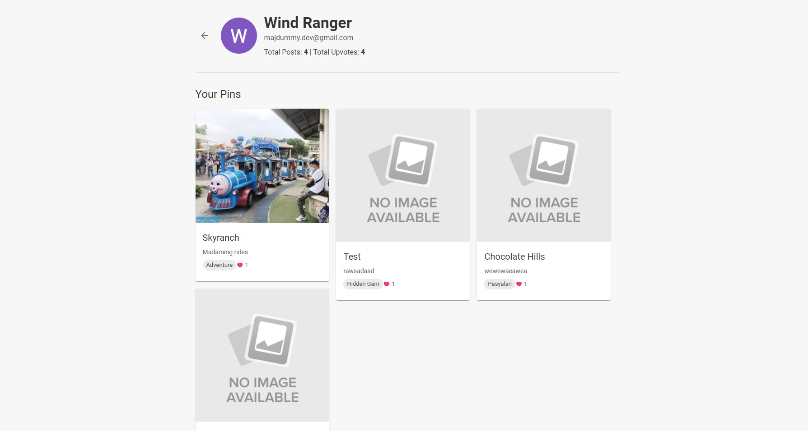

# LokalPins

**Discover, Share, Explore the Philippines**

LokalPins is a **community-driven map of the Philippines** where users can pin and share recommendations—food, activities, hidden spots, and more. Simpler and more social than Google Maps, it connects explorers with authentic local experiences.

---

## Table of Contents

- [Features](#features)
- [Tech Stack](#tech-stack)
- [Screenshots](#screenshots)
- [Getting Started](#getting-started)

---

## Features

### 1. Interactive Map

- Centered on the current location of user by default. ( deferred)
- Zoom, pan, and cluster pins to avoid clutter.
- Clicking a pin opens a popup card with:
  - Title
  - Description
  - Photo(s)

### 2. User Authentication

- Google login via **Firebase Auth**.
- Each user has a profile:
  - Name
  - Photo
  - Email
  - Added pins and liked posts
- Logged-in users can:
  - Add pins
  - Heart posts
- Non-logged-in users can view pins only.

### 3. Add a Recommendation (Pin)

Users can add a pin through a form with:

- **Title** – e.g., _Best Sisig Spot in Pampanga_
- **Description / short note**
- **Category** – Food Trip, Tambayan, Pasyalan, Adventure, Hidden Gem
- **Location** – select on map
- **Photo upload** – up to 10 photos

**Storage**:

- Pin data → Firebase Realtime Database
- Photos → Cloudinary

### 4. View Recommendations

- Map markers load dynamically from Firebase Realtime Database.
- Popup card shows:
  - Photo(s)
  - Title
  - Description
  - Category
  - Author (e.g., “posted by Juan”)
  - ❤️ Heart button with count
  - Clicking ❤️ stores a vote in Firebase
  - Each user can like a pin **only once**

---

### 5. Reviews

- Users can write reviews for any pins
- Reviews are automatically aggregated and displayed on the pin detail page
- Users can also write reviews for their own pins

### 6. User Profile

- Users can view their profile and see their pins / likes

## Tech Stack

- **Frontend:** React.js / TypeScript / Vite / Material UI
- **Map:** Leaflet.js
- **Authentication & Database:** Firebase Auth + Firebase Realtime Database
- **Image Storage:** Cloudinary

---

## Screenshots

- 
- 
- 

## Getting Started

### Prerequisites

- Node.js v14+
- npm / yarn
- Firebase project
- Cloudinary account

---

### Installation

1. Clone the repository:
   ```bash
   git clone <repo-url>
   cd <repo-folder>
   ```
2. Install dependencies
   ```bash
   npm install
   ```
3. Configure Firebase:
   - Enable Google Auth
   - Create a Realtime Database
   - Add env variables
4. Configure Cloudinary
   - Cloudinary Cloud Name
   - Cloudinary Upload Preset
5. Run the development server
   ```bash
   npm run dev
   ```

---
